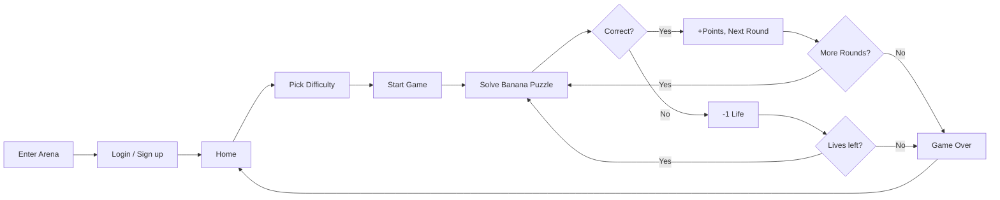

<p align="center">
  
</p>

<p align="center">
  <strong>Test your logic. Beat the clock.</strong>
</p>

<p align="center">
  
  
  
  
</p>

---

> 🎬 **Animated README** — This README uses badges, tables, and a **Mermaid flowchart** (rendered on GitHub/GitLab). Add a short gameplay GIF below for an extra animated demo!

<!-- Optional: add an animated gameplay GIF here for demo

-->

## 📑 Table of Contents

| # | Section |
|---|--------|
| 1 | [Features](#-features) |
| 2 | [How to Play](#-how-to-play) |
| 3 | [Game Rules](#-game-rules) |
| 4 | [Technologies](#-technologies) |
| 5 | [Setup](#-setup) |

---

## ✨ Features

| Category | Feature |
|----------|---------|
| **🎮 Gameplay** | Banana math puzzles from external API — solve the puzzle, pick the right number |
| | Three difficulties: **Easy**, **Medium**, **Hard** (rounds, time, retries, points vary) |
| | Per-round timer with visual ring; bonus points for answering quickly |
| | **Retries (lives)** — wrong answers cost one life; game over when lives reach zero |
| | Multiple-choice answers; correct/wrong feedback with animations and sound |
| | **Save & resume** — leave mid-game and come back (session storage) |
| **👤 Auth & Account** | Sign up with **email OTP verification** (6-digit code) |
| | Login with username or email + password |
| | **Forgot password** — request OTP by email, then reset on `/reset-password.html` |
| | JWT access + refresh tokens (HttpOnly cookies); session restore on refresh |
| **📊 Profile & Stats** | Profile: avatar, level, XP bar, high score, total games, wins |
| | **Achievements** — 15 unlockable badges (first game, rounds, perfect runs, score milestones, etc.) |
| | Update username; stats synced with backend |
| **🏆 Leaderboard** | Top 10 players by high score; “you” highlighted |
| **🎨 UX** | Responsive layout (mobile-friendly); retries bar visible on small screens |
| | Confetti, correct/wrong animations, toast feedback, optional sound |
| **🔧 Backend** | REST API: health, auth, users, leaderboard, Banana puzzle proxy |
| | MongoDB for users, refresh tokens, pending signups, password reset OTP |

---

## 🎯 How to Play



1. **Enter Arena** → From the splash screen, click **Enter Arena**.
2. **Sign in or create an account** → Use existing credentials or sign up (email OTP required).
3. **Home** → Choose **Easy**, **Medium**, or **Hard** and click **Start game**. You can also **Resume** a saved game if one exists.
4. **Each round**:
   - A **Banana puzzle** (math grid with a missing number) is shown.
   - You have a **countdown** (Easy: 90s, Medium: 60s, Hard: 30s).
   - Pick one of four numeric answers and click **Submit answer**.
5. **Correct** → You earn **base points + time bonus**; next round loads.
6. **Wrong** → You lose **one retry (life)**. If lives remain, the same round continues; if lives hit zero, **game over**.
7. **Time’s up** → Treated as wrong (no points, lose one life).
8. **Game over** → See final score, correct count, and rounds. Your **high score** and **achievements** update. From here you can **Play again** or go **Home**.

---

## 📜 Game Rules

| Rule | Description |
|------|-------------|
| **Rounds** | Easy: 5 · Medium: 10 · Hard: 15 |
| **Time per round** | Easy: 90s · Medium: 60s · Hard: 30s |
| **Retries (lives)** | Easy: 6 · Medium: 4 · Hard: 2. Shared across the whole game; wrong or timeout = −1 life. |
| **Scoring** | Base points per correct answer (Easy 100, Medium 150, Hard 200) **+** bonus per second left (Easy +2/s, Medium +3/s, Hard +5/s). Wrong or timeout = 0 points and −1 life. |
| **Win condition** | Answer **all** rounds correctly in one game (perfect run). |
| **Game over** | When retries reach **0** (or when the last round ends). |
| **Persistence** | High score, total games, wins, and achievements are saved to your account. Current game can be resumed after refresh until you finish or leave. |

---

## 🛠 Technologies

| Layer | Technology |
|-------|------------|
| **Frontend** | HTML5, CSS3 (custom properties, flexbox, grid, responsive), vanilla JavaScript |
| **Fonts** | Google Fonts (Inter, Outfit, JetBrains Mono) |
| **Backend** | Node.js, **Express 5** |
| **Database** | **MongoDB** (users, refresh_tokens, pending_signups) |
| **Auth** | **JWT** (access + refresh), **bcryptjs** for passwords, HttpOnly cookies |
| **Email** | **Nodemailer** (OTP for signup and password reset) |
| **Puzzles** | External **Banana API** (HTTPS) — proxied via `/api/banana-question` |
| **Env** | **dotenv** for configuration |

---

## 🚀 Setup

### Prerequisites

- **Node.js** (v18+ recommended)
- **MongoDB** (local or Atlas)
- (Optional) SMTP for signup OTP and password reset emails

### 1. Clone and install

```bash
git clone https://github.com/samitha123456789/Banana-api-game
cd Banana-api-game
npm install
```

### 2. Environment variables

Create a `.env` file in the project root:

| Variable | Required | Description |
|----------|----------|-------------|
| `MONGODB_URI` | ✅ | MongoDB connection string (e.g. `mongodb://localhost:27017` or Atlas URI) |
| `MONGODB_DB_NAME` | ❌ | Database name (default: `banana`) |
| `JWT_SECRET` | ✅ | Secret for access tokens |
| `JWT_REFRESH_SECRET` | ✅ | Secret for refresh tokens |
| `JWT_ACCESS_EXPIRES` | ❌ | Access token expiry (e.g. `15m`) |
| `JWT_REFRESH_EXPIRES` | ❌ | Refresh token expiry (e.g. `7d`) |
| `BANANA_API_URL` | ✅ | Full URL to the Banana puzzle API (must return `{ question, solution }`) |
| `PORT` | ❌ | Server port (default: `3000`) |
| `NODE_ENV` | ❌ | `production` for secure cookies |
| `SMTP_HOST` | ❌ | SMTP server for OTP emails |
| `SMTP_PORT` | ❌ | e.g. `587` or `465` |
| `SMTP_USER` | ❌ | SMTP username |
| `SMTP_PASSWORD` | ❌ | SMTP password |
| `SMTP_FROM_EMAIL` | ❌ | From address (defaults to `SMTP_USER`) |

**Minimal `.env` (game + auth; no email):**

```env
MONGODB_URI=mongodb://localhost:27017
JWT_SECRET=your-access-secret-min-32-chars
JWT_REFRESH_SECRET=your-refresh-secret-diff-from-above
BANANA_API_URL=https://your-banana-api.example/puzzle
PORT=3000
```

Without SMTP, signup OTP and forgot-password emails will fail (API returns 503); you can still use the legacy signup route if available, or test with login only.

### 3. Run

```bash
npm start
```

Then open **http://localhost:3000** in your browser.

### 4. Optional: Reset password page

The app links to **/reset-password.html** for “Forgot password?”. That page should call:

- `POST /api/forgot-password` with `{ "email": "user@example.com" }` to request an OTP.
- `POST /api/reset-password` with `{ "email", "otp", "newPassword" }` to set a new password.

---

<p align="center">
  <strong>🍌 Banana Challenge Arena</strong> — Play smart. Score big.
</p>
